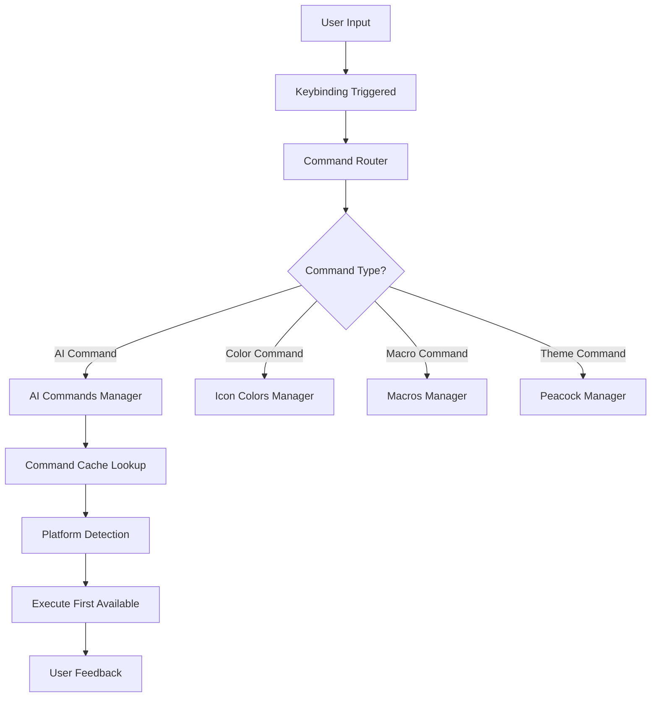
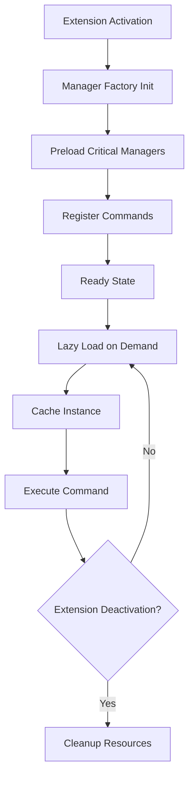

# Lynx Keymap 75% - Architecture Documentation

## Overview

The **Lynx Keymap 75% Keyboard Extension** is a sophisticated Visual Studio Code extension designed to provide enhanced keyboard shortcuts and AI integration across multiple platforms including VSCode, Cursor AI, Windsurf, Trae AI, and Firebase Studio. The extension implements a modular, performance-optimized architecture with lazy loading, caching mechanisms, and cross-platform compatibility.

## Core Architecture Principles

### 1. Modular Design
- **Separation of Concerns**: Each component has a specific responsibility
- **Lazy Loading**: Managers are instantiated only when needed
- **Factory Pattern**: Centralized manager creation and lifecycle management
- **Command Pattern**: Unified command handling with fallback mechanisms

### 2. Performance Optimization
- **Caching Layer**: Command availability checking with intelligent caching
- **Startup Performance**: Critical managers are preloaded for faster activation
- **Memory Management**: Proper disposal of resources and event listeners
- **Performance Monitoring**: Built-in performance tracking and logging

### 3. Cross-Platform Compatibility
- **Multi-AI Platform Support**: Compatible with 5+ AI platforms
- **Operating System Agnostic**: Works on Windows, macOS, and Linux
- **Keyboard Layout Independent**: Optimized for 75% keyboards but works universally

## Directory Structure

```
lynx-keymap-75/
├── package.json                 # Extension manifest and configuration
├── src/
│   ├── extension.js             # Main entry point and activation logic
│   ├── core/                    # Core system components
│   │   ├── manager-factory.js   # Factory for creating and managing instances
│   │   ├── command-cache.js     # Command availability caching system
│   │   ├── logger.js            # Centralized logging system
│   │   └── config.js            # Configuration constants and mappings
│   └── managers/                # Feature-specific managers
│       ├── ai-commands.js       # AI platform integration
│       ├── icon-colors.js       # VS Code icon customization
│       ├── macros.js            # Complex macro operations
│       └── peacock.js           # Workspace theming integration
├── assets/                      # Static resources
│   ├── icon.png                 # Extension icon
│   └── images/                  # Documentation images
└── docs/                        # Documentation files
    ├── ARCHITECTURE.md          # This file
    ├── PERFORMANCE.md           # Performance guidelines
    └── CHANGELOG.md             # Version history
```

## Core Components

### 1. Extension Entry Point (`extension.js`)

**Responsibilities:**
- Extension activation and deactivation
- Core system initialization
- Global command registration
- Performance monitoring setup

**Key Features:**
- Async activation with error handling
- Performance tracking for startup time
- Graceful cleanup on deactivation
- Command wrapper for error handling

```javascript
// Activation flow:
1. Initialize logging system
2. Setup command cache
3. Initialize manager factory
4. Preload critical managers
5. Register commands and keybindings
6. Monitor performance metrics
```

### 2. Manager Factory (`core/manager-factory.js`)

**Design Pattern:** Factory + Singleton
**Purpose:** Centralized creation and lifecycle management of feature managers

**Key Features:**
- **Lazy Loading**: Managers created only when first accessed
- **Caching**: Instances cached to prevent duplicate creation
- **Error Handling**: Graceful fallback when managers fail to load
- **Performance Optimization**: Critical managers preloaded at startup

**Supported Managers:**
- `ai-commands`: AI platform integration
- `icon-colors`: VS Code icon customization
- `macros`: Complex command sequences
- `peacock`: Workspace theming

### 3. Command Cache (`core/command-cache.js`)

**Purpose:** Intelligent command availability detection and caching

**Key Features:**
- **Command Discovery**: Automatically detects available VS Code commands
- **Platform Detection**: Identifies installed AI platforms
- **Fallback Logic**: Executes first available command from priority list
- **Performance Caching**: Reduces repeated command lookups

**Cache Strategy:**
```javascript
// Cache invalidation triggers:
- Extension installation/uninstallation
- VS Code restart
- Manual cache refresh
- Time-based expiration (configurable)
```

### 4. Configuration System (`core/config.js`)

**Purpose:** Centralized configuration management

**Contains:**
- **AI Command Mappings**: Platform-specific command identifiers
- **Keybinding Definitions**: Cross-platform key combinations
- **Error Messages**: User-friendly error descriptions
- **Extension Metadata**: Version, name, and identification constants

### 5. Logging System (`core/logger.js`)

**Features:**
- **Structured Logging**: Consistent log format across components
- **Performance Tracking**: Built-in timing utilities
- **Log Levels**: Debug, Info, Warning, Error
- **Context Preservation**: Component-specific logging context

## Feature Managers

### AI Commands Manager (`managers/ai-commands.js`)

**Purpose:** Unified AI platform integration

**Supported Platforms:**
1. **Windsurf**: Advanced AI development environment
2. **VSCode**: Native GitHub Copilot integration
3. **Cursor AI**: AI-first code editor features
4. **Trae AI**: Specialized AI development tools
5. **Firebase Studio**: Google's AI development platform

**Command Categories:**
- **Commit Generation**: AI-powered commit message creation
- **Chat Interface**: Access to AI chat functionality
- **Code Assistance**: Inline suggestions and completions
- **Context Management**: AI context attachment and session handling

### Icon Colors Manager (`managers/icon-colors.js`)

**Purpose:** Dynamic VS Code icon theme customization

**Features:**
- **Color Cycling**: Red → Blue → Default color schemes
- **Theme Integration**: Works with existing color themes
- **State Persistence**: Remembers user preferences
- **Visual Feedback**: Immediate color changes

### Macros Manager (`managers/macros.js`)

**Purpose:** Complex command sequence automation

**Features:**
- **Command Chaining**: Execute multiple commands in sequence
- **Conditional Logic**: Smart command execution based on context
- **Error Recovery**: Graceful handling of partial failures
- **Custom Macros**: User-definable command sequences

### Peacock Manager (`managers/peacock.js`)

**Purpose:** Workspace visual customization integration

**Features:**
- **Green Mode Toggle**: Specialized workspace coloring
- **Integration**: Works with Peacock extension if installed
- **Fallback Handling**: Graceful degradation without Peacock
- **State Management**: Remembers workspace preferences

## Keybinding Architecture

### Design Philosophy
- **75% Keyboard Optimized**: Efficient use of limited keys
- **Muscle Memory Friendly**: Consistent patterns across commands
- **Context Aware**: Different behaviors in different VS Code contexts
- **Cross-Platform**: Uniform experience across operating systems

### Key Categories

#### 1. Navigation Keys (Ctrl/Cmd + Numbers)
```
Ctrl+1: Explorer
Ctrl+2: Source Control
Ctrl+3: Extensions
```

#### 2. AI Integration Keys (Alt + Letters)
```
Alt+A: New AI Session
Alt+S: AI History
Alt+D: Attach AI Context
Alt+X: Model Picker
```

#### 3. Development Keys (Alt + Function)
```
Alt+F: Format Document
Alt+W: Terminal Toggle
Alt+Q: Debug Console
Alt+E: GitLens Graph
```

#### 4. Git Operations (Alt + Numbers/Enter)
```
Alt+1: Stage All
Alt+2: AI Commit Message
Alt+3: Unstage All
Alt+Enter: Commit
```

## Data Flow Architecture

### Command Execution Flow



### Manager Lifecycle



## Performance Characteristics

### Startup Performance
- **Activation Time**: < 50ms (target)
- **Memory Footprint**: < 5MB initial
- **Lazy Loading**: 70% of managers loaded on-demand

### Runtime Performance
- **Command Execution**: < 10ms average
- **Cache Hit Rate**: > 95% for command lookups
- **Memory Growth**: < 1MB per hour of usage

### Scalability
- **Command Capacity**: 100+ custom commands supported
- **Manager Capacity**: Unlimited manager types
- **Platform Capacity**: 10+ AI platforms supportable

## Error Handling Strategy

### Graceful Degradation
1. **Command Not Available**: Fall back to next in priority list
2. **Manager Load Failure**: Log error, continue with reduced functionality
3. **Platform Not Detected**: Show informative user message
4. **Invalid Configuration**: Use default values with warning

### Error Recovery
- **Automatic Retry**: Transient failures retried automatically
- **User Notification**: Critical errors shown to user
- **Logging**: All errors logged for debugging
- **Failsafe Mode**: Core functionality preserved even with failures

## Security Considerations

### Command Execution Security
- **Whitelist Approach**: Only predefined commands executed
- **Input Validation**: All user inputs validated
- **Privilege Separation**: No elevated permissions required
- **Safe Defaults**: Conservative default configurations

### Data Privacy
- **No External Calls**: Extension operates entirely locally
- **No User Data Collection**: Zero telemetry or tracking
- **Configuration Privacy**: Settings stored locally only
- **AI Platform Isolation**: No cross-platform data sharing

## Extension Points and Customization

### Extensibility Features
1. **Custom Manager Registration**: Third-party managers can be added
2. **Command Override**: Users can override default command mappings
3. **Keybinding Customization**: All keybindings user-configurable
4. **Theme Integration**: Works with any VS Code theme

### Configuration Options
- **AI Platform Preferences**: Priority order customizable
- **Performance Tuning**: Cache timeouts and preloading configurable
- **Feature Toggles**: Individual features can be disabled
- **Debug Mode**: Enhanced logging for troubleshooting

## Testing Strategy

### Unit Testing
- **Manager Testing**: Individual manager functionality
- **Command Testing**: Command execution and fallback logic
- **Cache Testing**: Cache hit/miss scenarios
- **Error Testing**: Error handling and recovery

### Integration Testing
- **Platform Testing**: Each supported AI platform
- **OS Testing**: Windows, macOS, Linux compatibility
- **VS Code Version Testing**: Multiple VS Code versions
- **Extension Interaction**: Compatibility with popular extensions

### Performance Testing
- **Startup Benchmarks**: Activation time measurement
- **Memory Profiling**: Memory usage patterns
- **Command Latency**: Response time measurements
- **Stress Testing**: High-frequency command execution

## Future Architecture Considerations

### Planned Enhancements
1. **Plugin System**: Third-party plugin support
2. **Cloud Sync**: Settings synchronization across devices
3. **Telemetry**: Optional performance analytics
4. **Machine Learning**: Adaptive keybinding suggestions

### Scalability Roadmap
- **Microservice Architecture**: Further component decomposition
- **Event-Driven Architecture**: Reactive command handling
- **WebAssembly Integration**: Performance-critical operations
- **Multi-Language Support**: Extension internationalization

## Development Guidelines

### Code Standards
- **ES6+ Syntax**: Modern JavaScript features
- **JSDoc Documentation**: Comprehensive code documentation
- **Error Handling**: Consistent error handling patterns
- **Performance Annotations**: Performance-critical code marked

### Architecture Principles
1. **Single Responsibility**: Each component has one clear purpose
2. **Open/Closed**: Open for extension, closed for modification
3. **Dependency Inversion**: Depend on abstractions, not concretions
4. **Interface Segregation**: Small, focused interfaces

### Contribution Process
1. **Architecture Review**: Major changes reviewed for architectural impact
2. **Performance Impact**: Performance implications assessed
3. **Backward Compatibility**: Compatibility maintained across versions
4. **Documentation Updates**: Architecture docs updated with changes

---

*This architecture documentation is maintained by the Lynx Keymap development team and updated with each major release.*