# Lynx Keymap 75% Architecture

## Overview

**Lynx Keymap 75%** standardizes keyboard shortcuts across all code editors, specifically adapted for 75% keyboards. It enables developers to use key combinations to access any functionality with precision and consistency, optimizing development workflow with a unified and efficient experience regardless of the editor used.

The extension provides advanced AI functionality, intelligent color management, and sophisticated macro systems, ensuring seamless operation across multiple code editors including VS Code, Cursor, Windsurf, Trae.ai, Kiro, and Firebase Studio.

### Key Value Propositions

- **🎯 75% Keyboard Optimization**: Tailored shortcuts that maximize the compact layout efficiency
- **🌐 Universal Editor Support**: Consistent experience across 6 major code editors
- **🤖 Intelligent AI Integration**: Smart fallback system for AI commands across platforms
- **⚡ Enhanced Productivity**: Streamlined workflows through optimized key combinations
- **🎨 Visual Customization**: Dynamic color management for improved visual feedback
- **🔄 Macro Automation**: Complex command sequences with precise timing control

## How it Works

When a user activates the **Lynx Keymap 75%** extension in VS Code:

1. The `package.json` file registers keybindings and commands through the `contributes` field.
2. The **Extension Host** initializes all manager components and registers command handlers.
3. Based on user interactions, the **AI Command Engine** detects available editors and executes appropriate commands.
4. The **Visual Management System** handles color customizations for status bar and icons.
5. The **Macro System** orchestrates complex command sequences with intelligent timing.

> 💡 **Note on multi-editor compatibility:**  
> AI commands use a priority-based fallback system to ensure functionality across different editors. Each command type maintains an ordered list of editor-specific implementations.

---

## Architecture Diagram

```mermaid
graph TB
    subgraph "📦 Lynx Keymap 75% Extension"
        direction TB
        A[package.json<br/>📋 Main Configuration]

        subgraph "🔧 Core Structure"
            direction LR
            B[Contributes] --> C[⌨️ Keybindings]
            B --> D[🤖 Commands]
        end

        subgraph "🎯 Manager Systems"
            direction TB
            E[AICommandsManager<br/>🤖 AI Integration]
            F[StatusBarManager<br/>🎨 Color Management]
            G[ColorManager<br/>🎯 Icon Colors]
            H[MacroManager<br/>⚡ Command Sequences]
        end

        subgraph "🤖 AI Command Engine"
            direction TB
            I[ai-keymap-config.js<br/>⚙️ Command Mappings]
            J[ai-keymap-handler.js<br/>🔄 Execution Logic]

            subgraph "🌐 Multi-Editor Support"
                direction LR
                K[🌊 Windsurf<br/>Priority 0]
                L[📝 VS Code<br/>Priority 1]
                M[🎯 Cursor-AI<br/>Priority 2]
                N[🚀 Trae-AI<br/>Priority 3]
                O[🔥 Firebase Studio<br/>Priority 4]
                P[🤖 Kiro<br/>Priority 5]
            end
        end

        subgraph "🎨 Visual Management System"
            direction TB
            Q[Status Bar Colors<br/>🟦🟩🟨🟥⬜]
            R[Icon Colors<br/>🔵🟢⚪]
            S[Smart Color Selection<br/>🧠 History-based]
        end

        subgraph "⚡ Macro System"
            direction TB
            T[Command Sequences<br/>📋 Ordered Execution]
            U[Timing Control<br/>⏱️ Delays & Sync]
            V[Error Handling<br/>🛡️ Robust Recovery]
        end
    end

    subgraph "🎯 VS Code Integration Layer"
        direction TB
        W[VS Code Extension Host<br/>🏠 Runtime Environment]

        subgraph "⚙️ Engine Systems"
            direction LR
            X[Command Engine<br/>⌨️ Keymap Processing]
            Y[UI Engine<br/>🎨 Visual Updates]
        end

        Z[User Interface<br/>👤 Editor Experience]
    end

    %% Main connections
    A --> B
    C --> E
    C --> F
    C --> G
    C --> H
    D --> E

    %% AI Engine connections
    E --> I
    E --> J
    I --> K
    I --> L
    I --> M
    I --> N
    I --> O
    I --> P

    %% Visual System connections
    F --> Q
    F --> S
    G --> R

    %% Macro System connections
    H --> T
    H --> U
    H --> V

    %% Integration connections
    A -.-> W
    E -.-> X
    F -.-> Y
    G -.-> Y
    H -.-> X
    X --> Z
    Y --> Z
    W --> X
    W --> Y

    %% Styling
    classDef mainConfig fill:#ff6b6b,stroke:#333,stroke-width:2px,color:#fff
    classDef managers fill:#4ecdc4,stroke:#333,stroke-width:2px,color:#fff
    classDef aiEngine fill:#45b7d1,stroke:#333,stroke-width:2px,color:#fff
    classDef visual fill:#96ceb4,stroke:#333,stroke-width:2px,color:#fff
    classDef macro fill:#feca57,stroke:#333,stroke-width:2px,color:#000
    classDef integration fill:#a8e6cf,stroke:#333,stroke-width:2px,color:#000
    classDef editors fill:#dda0dd,stroke:#333,stroke-width:2px,color:#000

    class A mainConfig
    class E,F,G,H managers
    class I,J aiEngine
    class Q,R,S visual
    class T,U,V macro
    class W,X,Y,Z integration
    class K,L,M,N,O,P editors
```



---

## Project Structure

```
lynx-keymap-75/
├── src/
│   ├── extension.js              # Main entry point & lifecycle management
│   ├── editor-ui/                # User interface components
│   │   ├── status-bar.js         # Status bar color management
│   │   └── icons/
│   │       ├── icon-painter.js   # Icon color cycling system
│   │       └── macros.js         # Macro execution engine
│   └── keymaps/                  # Keyboard mapping configuration
│       ├── ai-keymap-config.js   # AI command definitions
│       └── ai-keymap-handler.js  # AI command execution logic
├── assets/                       # Visual resources & branding
├── package.json                  # Extension manifest & configuration
└── README.md                     # User documentation
```

## Core Components

### 1. Extension.js - Main Entry Point

**Responsibility**: Lifecycle management and component coordination.

```javascript
// Manages extension lifecycle and component initialization
function activate(context) {
  // Initialize manager instances
  // Register command handlers
  // Configure subscriptions
  // Coordinate component interactions
}
```

**Key Features**:

- Global manager initialization
- Command registration and binding
- Extension lifecycle management
- Inter-component coordination

### 2. AI Management System

#### AICommandsManager (`ai-keymap-handler.js`)

**Responsibility**: Intelligent AI command execution across multiple editors.

**Core Capabilities**:

- Automatic editor detection and availability checking
- Intelligent fallback command execution
- Comprehensive error handling and user notifications
- Multi-provider AI integration support

**Command Execution Flow**:

```javascript
async executeFirstAvailableCommand(commands, errorMessage) {
  // 1. Get all available VS Code commands
  // 2. Iterate through priority-ordered command list
  // 3. Execute first available command
  // 4. Handle errors and provide user feedback
}
```

#### AI Configuration (`ai-keymap-config.js`)

**Responsibility**: Define command mappings for different editors.

**Supported Editors** (Priority Order):

- **Windsurf** (Priority 0) - Advanced AI features
- **VS Code** (Priority 1) - Standard implementation
- **Cursor-AI** (Priority 2) - Specialized AI tools
- **Trae-AI** (Priority 3) - Alternative AI provider
- **Firebase Studio** (Priority 4) - Basic AI support
- **Kiro** (Priority 5) - Emerging AI platform

**Available AI Commands**:

- **Commit Generation** (`Alt+2`) - AI-powered git commit messages
- **Chat Popup** (`Ctrl+\``) - Inline AI chat interface
- **Chat Panel** (`Shift+Tab`) - Dedicated AI chat sidebar
- **New Session** (`Alt+A`) - Create fresh AI conversation
- **History** (`Alt+S`) - Access previous AI interactions
- **Attach Context** (`Alt+D`) - Add context to AI conversations

### 3. Visual Management System

#### StatusBarManager (`status-bar.js`)

**Responsibility**: Intelligent status bar color management with smart rotation.

**Advanced Features**:

- **5 Color Palette**: Green, Blue, Orange, Lemon, Red
- **Smart History System**: Prevents recent color repetition (3-color memory)
- **Workspace Persistence**: Maintains state across sessions
- **Clean Initialization**: Fresh state on each VS Code startup

**Smart Color Selection Algorithm**:

```javascript
getSmartColor() {
  const availableColors = this.getAvailableColors();
  // Excludes recently used colors from selection pool
  // Ensures visual variety and prevents monotony
  return randomSelection(availableColors);
}
```

**State Management**:

- `STATE_MEMENTO_KEY`: Active/inactive status
- `CURRENT_COLOR_KEY`: Currently applied color
- `COLOR_HISTORY_KEY`: Recent color usage history

#### ColorManager (`icon-painter.js`)

**Responsibility**: Icon color cycling with simple state management.

**Color Cycle**:

- **Blue** (`#008dfa`) → **Green** (`#07cc4cff`) → **Default** (`null`)
- Global configuration persistence
- Immediate visual feedback

### 4. Macro System

#### MacroManager (`macros.js`)

**Responsibility**: Sequential command execution with precise timing control.

**Advanced Capabilities**:

- **Sequential Execution**: Commands run in defined order
- **Configurable Delays**: Precise timing between commands
- **Execution Lock**: Prevents concurrent macro execution
- **Robust Error Handling**: Graceful failure recovery

**Primary Macro Implementation**:

```javascript
// Alt+Z: Agent Mode Toggle + Icon Color Change
executeColorAndAgentMacro() {
  const sequence = [
    { command: 'workbench.action.chat.toggleAgentMode', delay: 10 },
    { command: 'lynx-keymap.cycleIconColor' }
  ];
  await this.executeSequence(sequence);
}
```

## Data Flow Architecture

### Extension Initialization

```
Extension.activate()
├── ColorManager.initialize()
├── MacroManager.initialize()
├── StatusBarManager.initialize()
│   └── initializeCleanState()
├── AICommandsManager.initialize()
│   └── registerCommands()
└── registerGlobalCommands()
```

### AI Command Execution Flow

```
User triggers keyboard shortcut
├── VS Code executes registered command
├── AICommandsManager.executeFirstAvailableCommand()
├── Query available commands from VS Code API
├── Iterate through priority-ordered command list
├── Execute first available command
└── Display user notification if all commands fail
```

### Color Management Flow

```
User presses Ctrl+Alt+PgDn
├── StatusBarManager.toggleStatusBarColor()
├── getSmartColor() (avoids recent repetitions)
├── updateWorkspaceColors()
├── updateColorHistory()
└── Persist state to workspace storage
```

### Macro Execution Flow

```
User triggers macro (Alt+Z)
├── MacroManager.executeColorAndAgentMacro()
├── Check execution lock status
├── Execute command sequence with delays
├── Handle individual command errors
└── Release execution lock
```

## Design Patterns Implementation

### 1. Manager Pattern

Each core functionality is encapsulated in dedicated managers:

- **`AICommandsManager`** - AI command orchestration
- **`StatusBarManager`** - Visual status bar management
- **`ColorManager`** - Icon color state management
- **`MacroManager`** - Command sequence execution

### 2. Command Pattern

Uniform command registration and execution:

```javascript
vscode.commands.registerCommand(commandId, async () => {
  await this.executeCommand(parameters);
});
```

### 3. Strategy Pattern

AI commands implement fallback strategies:

```javascript
// Attempts commands in priority order until success
for (const cmd of prioritizedCommands) {
  if (isCommandAvailable(cmd)) {
    return await executeCommand(cmd);
  }
}
```

### 4. State Pattern

`StatusBarManager` maintains persistent state transitions:

- **Active/Inactive states**
- **Current color state**
- **Color history state**

### 5. Observer Pattern

Extension lifecycle management:

```javascript
context.subscriptions.push(
  // Automatic cleanup on extension deactivation
  disposable1,
  disposable2,
  disposable3
);
```

## Keyboard Shortcut Configuration

### Primary Categories

#### Core Navigation

- **`Ctrl+1/2/3`**: Explorer, Source Control, Extensions
- **`Ctrl+Tab`**: Toggle sidebar visibility
- **`Alt+C/V`**: New file/folder creation

#### Git & Version Control

- **`Alt+1`**: Stage all changes
- **`Alt+2`**: AI-powered commit message generation
- **`Alt+3`**: Unstage all changes
- **`Alt+4`**: Git pull operation
- **`Alt+Enter`**: Git commit
- **`Ctrl+Alt+Enter`**: Git push

#### AI & Productivity

- **`Ctrl+\``**: AI chat popup interface
- **`Shift+Tab`**: AI chat panel toggle
- **`Alt+A/S/D`**: New session/History/Context attachment
- **`Alt+Z`**: Macro execution (agent + color)
- **`Alt+X`**: AI model picker

#### Visual Customization

- **`Ctrl+Alt+PgDn`**: Status bar color cycling
- **Icon colors**: Integrated within macro system

#### Development Workflow

- **`Alt+F`**: Format document
- **`Ctrl+Alt+F`**: Format selection
- **`Shift+Alt+F`**: Organize imports
- **`Insert`**: Start debugging
- **`Alt+Insert`**: Restart debugging
- **`Ctrl+Insert`**: Stop debugging

## Multi-Editor Compatibility

The extension achieves cross-editor functionality through:

### Automatic Detection System

```javascript
const allCommands = await vscode.commands.getCommands(true);
if (allCommands.includes(targetCommand)) {
  // Execute editor-specific command
  await vscode.commands.executeCommand(targetCommand);
}
```

### Priority-Based Execution Order

1. **Windsurf** - Advanced AI capabilities and priority commands
2. **VS Code** - Standard Microsoft implementation
3. **Cursor-AI** - Specialized AI-focused commands
4. **Trae-AI** - Alternative AI provider integration
5. **Firebase Studio** - Basic AI functionality
6. **Kiro** - Emerging platform specialized commands

### Adaptive Configuration System

Shortcuts automatically adapt based on:

- **Available commands** in current editor environment
- **Installed extensions** and their capabilities
- **Workspace configuration** and user preferences
- **Editor-specific features** and limitations

### Fallback Mechanism

```javascript
// Intelligent command fallback system
const commandPriorities = [
  'windsurf.prioritized.command',
  'vscode.standard.command',
  'cursor.specialized.command',
  'trae.alternative.command',
  'firebase.basic.command',
  'kiro.emerging.command',
];

for (const command of commandPriorities) {
  if (await isCommandAvailable(command)) {
    return await executeCommand(command);
  }
}
```

## State Management Architecture

### Workspace State Management

- **Status bar color states** - Active/inactive status and current color
- **Color history tracking** - Maximum 3 recent colors to prevent repetition
- **Active color persistence** - Maintains selection across sessions

### Global State Management

- **Icon color configuration** - Global VS Code settings persistence
- **User preferences** - Cross-workspace configuration storage

### Session State Management

- **Macro execution status** - Prevents concurrent macro execution
- **Available commands cache** - Performance optimization for command detection
- **Editor capability detection** - Runtime editor feature availability

## Error Handling & Recovery

### Recovery Strategies

1. **Command Fallback System**: Automatic progression through priority-ordered alternatives
2. **Informative User Notifications**: Clear, actionable error messages
3. **Comprehensive Logging**: Detailed debugging information for development
4. **Clean State Initialization**: Fresh state reset on each VS Code startup

### Error Categories & Handling

- **Command Unavailability**: Graceful fallback to alternative implementations
- **Execution Failures**: Robust error catching with user feedback
- **Configuration Issues**: Automatic state recovery and user guidance
- **State Corruption**: Clean state reinitialization mechanisms

```javascript
// Example error handling pattern
try {
  await vscode.commands.executeCommand(primaryCommand);
} catch (error) {
  console.error(`Primary command failed: ${error.message}`);
  await this.executeAlternativeCommand(fallbackCommands);
}
```

## Extensibility Framework

### Adding New AI Commands

1. **Update Configuration**: Extend `AI_COMMANDS_CONFIG` with new command mappings
2. **Register Keymap**: Add entry to `KEYMAP_CONFIG` with appropriate error messaging
3. **Package Registration**: Include command definition in `package.json` contributes section
4. **Documentation**: Update README.md with new functionality

### Adding New Color Schemes

1. **Extend Color Palette**: Update `COLORS` object in `StatusBarManager`
2. **Update Color Names**: Add corresponding entries to `COLOR_NAMES`
3. **Modify Selection Logic**: Update `colorKeys` array for selection algorithm
4. **Test Integration**: Verify smart selection algorithm functionality

### Adding New Macro Sequences

1. **Create Macro Method**: Implement new method in `MacroManager`
2. **Define Command Sequence**: Specify commands and timing configuration
3. **Register Command**: Add command registration in `extension.js`
4. **Bind Keyboard Shortcut**: Update `package.json` keybindings section

## Performance Optimization

### Implemented Optimizations

- **Command Availability Caching**: Reduces repeated API calls
- **Lazy Component Initialization**: Components initialize only when needed
- **Automatic Disposable Cleanup**: Prevents memory leaks through proper cleanup
- **Minimal Memory Footprint**: Efficient state management with minimal overhead

### Performance Best Practices

- **Context Subscription Management**: Proper use of `context.subscriptions` for cleanup
- **Asynchronous Command Handling**: Non-blocking command execution
- **Polling Avoidance**: Event-driven architecture instead of continuous polling
- **Efficient State Management**: Optimized data structures and access patterns

```javascript
// Performance-optimized command caching
class CommandCache {
  constructor() {
    this.availableCommands = null;
    this.cacheExpiry = null;
  }

  async getAvailableCommands() {
    if (this.isCacheValid()) {
      return this.availableCommands;
    }

    this.availableCommands = await vscode.commands.getCommands(true);
    this.cacheExpiry = Date.now() + 30000; // 30-second cache
    return this.availableCommands;
  }
}
```

## Security & Privacy Considerations

### Local Data Management

- **Complete Local Storage**: All state maintained within VS Code workspace
- **No External Communication**: Zero network requests or external data transmission
- **Workspace-Scoped Configuration**: Settings isolated per workspace for security

### Minimal Permission Model

- **VS Code Configuration Access Only**: Limited to workspace and global settings
- **No File System Access**: No direct access to user files or directories
- **No External Code Execution**: All functionality contained within extension boundaries
- **Transparent Operation**: All actions visible and controllable by user

## Testing & Quality Assurance

### Testing Strategy

- **Unit Testing**: Individual component functionality verification
- **Integration Testing**: Cross-component interaction validation
- **Multi-Editor Testing**: Compatibility verification across supported editors
- **Performance Testing**: Resource usage and response time validation

### Quality Metrics

- **Code Coverage**: Comprehensive test coverage for critical paths
- **Performance Benchmarks**: Response time and memory usage standards
- **Compatibility Matrix**: Support verification across editor versions
- **User Experience Validation**: Usability and accessibility compliance

## Conclusion

**Lynx Keymap 75%** implements a sophisticated, modular architecture that standardizes keyboard shortcuts across all code editors, specifically optimized for 75% keyboard layouts. The extension enables developers to access any functionality through precise and consistent key combinations, creating a unified development experience.

### Architectural Strengths

- **🎯 75% Keyboard Specialization**: Purpose-built for compact keyboard layouts with maximum efficiency
- **🌐 Universal Editor Standardization**: Consistent shortcuts across 6 major code editors
- **🤖 Intelligent AI Integration**: Smart command fallback and multi-provider AI support
- **🎨 Advanced Visual Management**: Dynamic color systems with intelligent selection algorithms
- **⚡ Robust Macro System**: Flexible command sequencing with precise timing control
- **🔧 Performance Excellence**: Optimized resource usage and responsive user experience
- **📈 Extensible Framework**: Easy addition of new features and customizations

### Impact on Development Workflow

This architecture ensures that developers can maintain their preferred keyboard shortcuts and workflow patterns regardless of which code editor they choose to use. By standardizing the development experience across platforms, **Lynx Keymap 75%** eliminates the friction of switching between editors and maximizes productivity through consistent, optimized key combinations designed specifically for 75% keyboards.

The result is a maintainable, scalable, and user-friendly system that provides developers with a powerful, unified development environment that adapts to their tools rather than forcing them to adapt to different shortcut schemes.
